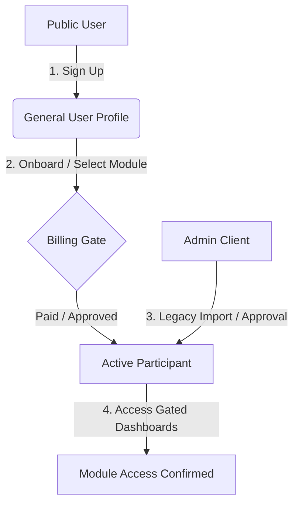

# Phase 9: Full E2E Certification

This certification report documents the automated E2E testing coverage, scenarios, and validation suites executed via Playwright.

---

## 1. E2E Test Suite Scope

The certification suite covers the complete user lifecycle, administration loops, and payment integration mocks.



---

## 2. Core Test Scenarios

### Scenario 9.1: Unauthorized Gating (Middleware Certification)
- **Objective**: Certify path security.
- **Steps**:
  1. Browser attempts to navigate directly to `/cooperatives/dashboard`.
  2. Asserts that the URL redirects to `/auth/login?callbackUrl=...`.
  3. Browser logs in with valid credentials.
  4. Asserts that the page redirects back to `/cooperatives/dashboard`.

### Scenario 9.2: Legacy Member Onboarding (No Payment Checkouts)
- **Objective**: Certify that legacy members do not see checkout/payment screen.
- **Steps**:
  1. Admin onboards a legacy member with email `legacytest@easysales.com` for cooperatives.
  2. Legacy user logs in and goes to `/cooperatives/onboarding`.
  3. Asserts that step 4 (payment) is bypassed, and they can directly submit the profile form.
  4. Asserts redirect to `/cooperatives/dashboard`.

### Scenario 9.3: Admin Role Isolation
- **Objective**: Certify role security restrictions.
- **Steps**:
  1. Admin logs in and opens `/admin/users`.
  2. Admin edits roles for a user.
  3. Asserts that module participant checkboxes (e.g. `cooperative_member`) are absent.
  4. Asserts that saving changes only writes valid administrative roles.

### Scenario 9.4: Paginated Admin Search
- **Objective**: Certify user search and cursor pagination.
- **Steps**:
  1. Admin navigates to `/admin/users` and selects filters.
  2. Asserts table loads correctly.
  3. Admin searches for a user by email exact match.
  4. Asserts only matching user row is rendered.

---

## 3. Playwright Command References

To execute E2E tests:
```bash
# Run all E2E tests
npm run test:e2e

# Run tests in UI mode
npm run test:e2e:ui

# Run specific E2E test file
npx playwright test e2e/middleware.spec.ts
```
